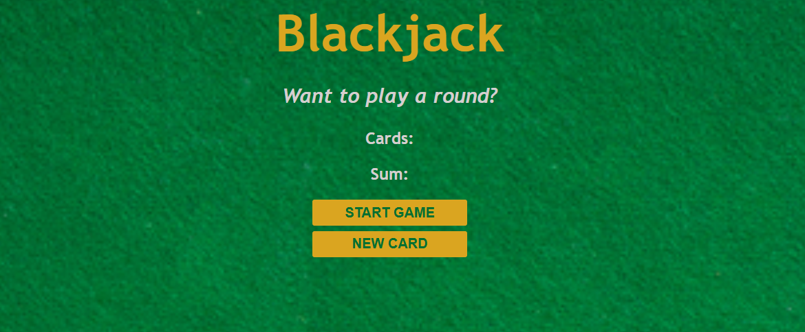

# 🃏 Blackjack Game

<p align="center">
  
</p>

<h3 align="center">
A browser-based Blackjack game built with HTML, CSS, and JavaScript.
</h3>

<p align="center">
A simple interactive card game where players can start a game, draw new cards, and try their luck against the dealer.
</p>

---

## Overview

**Blackjack Game** is my first JavaScript-based game project that simulates the classic Blackjack card game experience directly in the browser.

The player starts with a balance of **$50** and tries to achieve **Blackjack (21 points)** by drawing cards.

- If the player gets Blackjack → wins **$200**
- If the player loses → loses the starting **$50**

This project focuses on JavaScript fundamentals including game logic, state management, DOM manipulation, and event handling.

---

## Features

- 🃏 Start a new Blackjack game
- 🎴 Draw new cards during gameplay
- 💰 Player balance tracking
- 🏆 Blackjack win condition
- ❌ Loss detection
- 🔄 Dynamic UI updates
- 🎨 Custom Blackjack table interface

---

## Preview

<p align="center">
   <br>
  You can try this: https://loquacious-tanuki-5033f9.netlify.app/
</p>

---

## Tech Stack

| Technology | Purpose |
|------------|---------|
| HTML5 | Game structure |
| CSS3 | Styling and visual design |
| JavaScript (ES6) | Game logic and interactions |

---

## 📂 Project Structure

```
my-first-game/
│
├── images/
│   └── table.png
|   └── game-preview1.png
|   └── game-preview2.png
│
├── index.html          # Game interface
├── index.css           # Styling and layout
├── index.js            # Blackjack game logic
│
└── README.md
```

---

## Game Rules

### Starting Game

Player:

```
Name: Sristi
Starting Balance: $50
```

The player starts a Blackjack round by clicking:

```
START GAME
```

---

### Drawing Cards

During gameplay, the player can click:

```
NEW CARD
```

to draw additional cards and increase the score.

The goal is to reach:

```
21 points (Blackjack)
```

without exceeding the limit.

---

### Winning Condition

If the player gets Blackjack:

```
🎉 Blackjack!
Reward: $200
```

---

### Losing Condition

If the player loses:

```
Game Over
Lost: $50
```

---

## Concepts Implemented

This project helped me practice:

- JavaScript variables and data types
- Arrays and random values
- Functions
- Conditional statements
- DOM manipulation
- Event listeners
- Game state management
- Dynamic content rendering

---

## Future Improvements

Planned improvements:

- [ ] Add dealer AI logic
- [ ] Add card images instead of numbers
- [ ] Add multiple betting options
- [ ] Add animations and sound effects
- [ ] Add leaderboard system
- [ ] Improve mobile responsiveness

---

## Author

**Saidur Ahrar Sristi**

Computer Science & Engineering Student

GitHub:  
https://github.com/Sristi101

LinkedIn:  
https://linkedin.com/in/saidur-ahrar-sristi/

---

## Acknowledgements

Inspired by learning JavaScript fundamentals and building interactive browser applications project from **@Scrimba's JavaScript Career Path**.

---

⭐ If you like this project, consider giving it a star!
